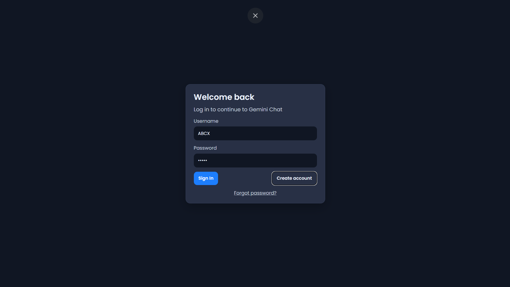
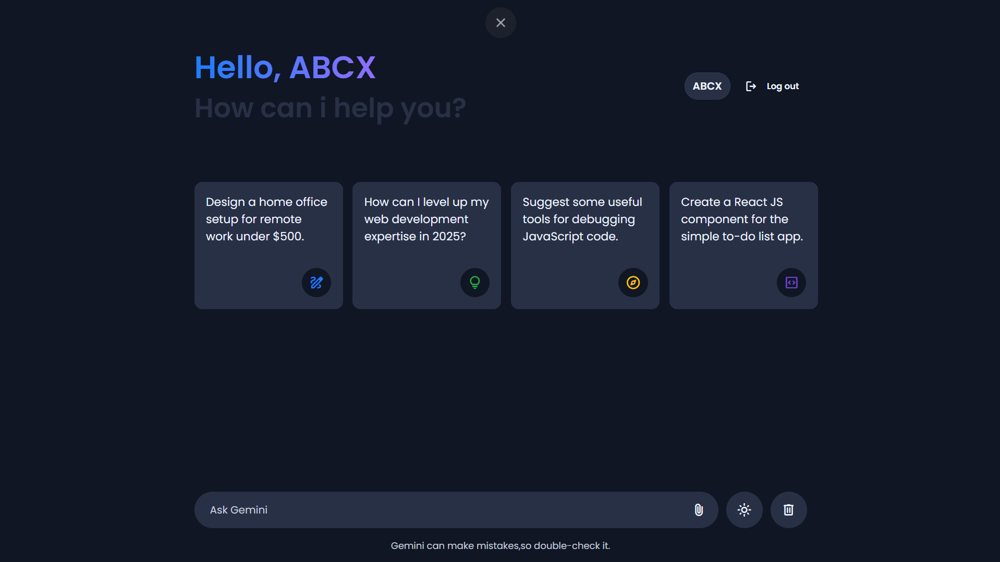
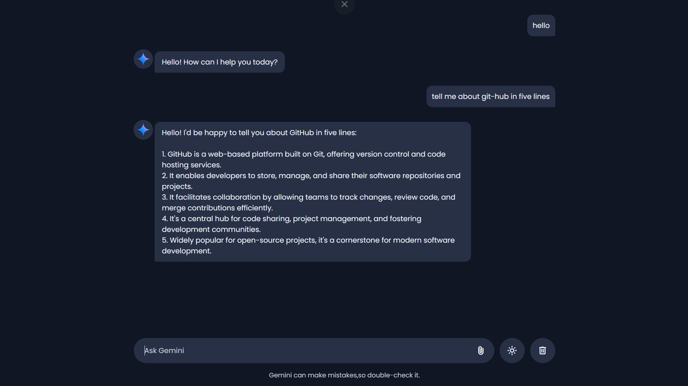
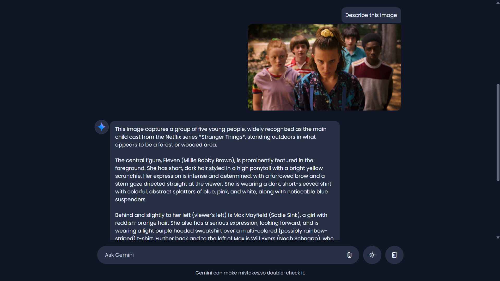
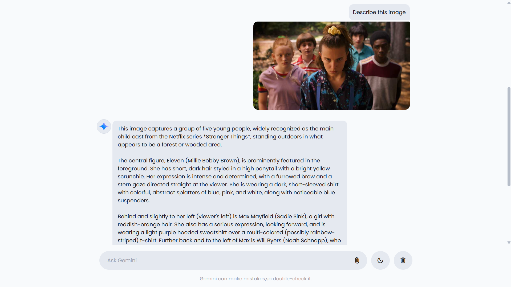
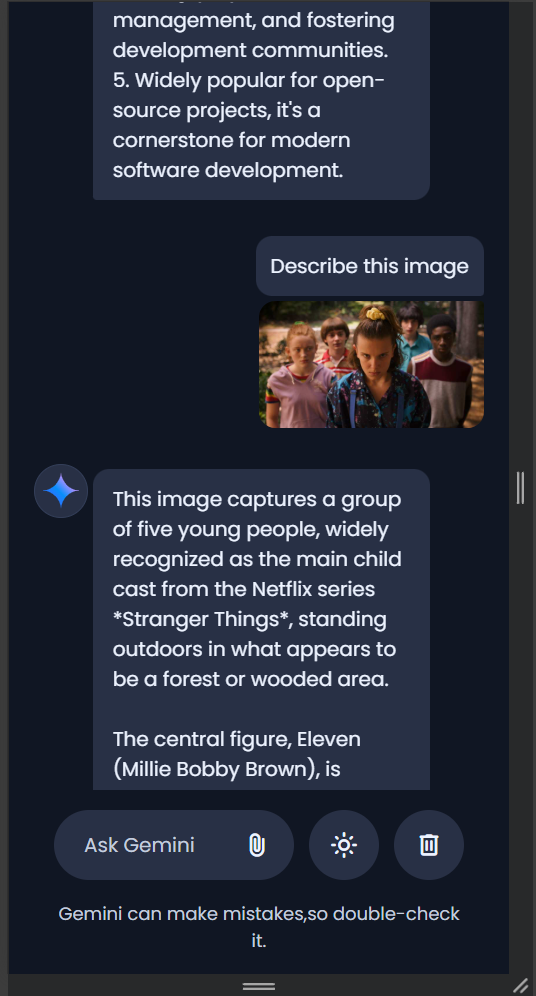

# Gemini AI Web Interface

A modern, responsive AI chat application inspired by Google Gemini. Built with HTML, CSS, and JavaScript, the application integrates the Google Gemini API to provide AI-powered conversations in a clean and intuitive interface.

> **Disclaimer:** This project is an independent educational implementation inspired by the Google Gemini interface and is not affiliated with or endorsed by Google.

---

## Features

- AI-powered conversations using the Google Gemini API
- User authentication (Login & Sign Up)
- Image and file upload support
- Dark and Light theme toggle
- Responsive design for desktop and mobile
- Chat history management
- Typing animation for AI responses
- Clean and modern user interface

---

## Screenshots

### Login



### Sign Up


### Home



### AI Conversation



### Image Upload



### Light Theme



### Mobile View



---

## Tech Stack

- HTML5
- CSS3
- JavaScript (ES6)
- Google Gemini API
- Local Storage
- Google Material Symbols

---

## Project Structure

```text
gemini-ai-web-interface/
│
├── assets/
├── screenshots/
├── index.html
├── login.html
├── script.js
├── style.css
├── config.example.js
├── README.md
├── LICENSE
└── .gitignore
```

---

## Getting Started

### Clone the repository

```bash
git clone https://github.com/harshraj-31/gemini-ai-web-interface.git
```

Navigate to the project directory.

```bash
cd gemini-ai-web-interface
```

---

## Configuration

Create a file named **config.js** in the project root using the following format:

```javascript
const CONFIG = {
    API_KEY: "YOUR_API_KEY"
};
```

Replace `YOUR_API_KEY` with your own Google Gemini API key.

> **Important:** Never commit `config.js` to GitHub. The file is ignored through `.gitignore`.

---

## Running the Project

Simply open **index.html** in your preferred web browser.

No additional installation or dependencies are required.

---

## Future Improvements

- Multiple chat sessions
- Persistent conversation history
- Markdown support
- Code syntax highlighting
- Voice input and output
- Progressive Web App (PWA)
- Backend authentication

---

## License

This Project is intended for educational purposes.

---

## Author

**Harshrajsinh Zala**

MCA Student • Web Developer • AI Enthusiast

GitHub: https://github.com/harshraj-31

---

## Acknowledgements

- Google Gemini API
- Google Material Symbols
- Open-source web development community
